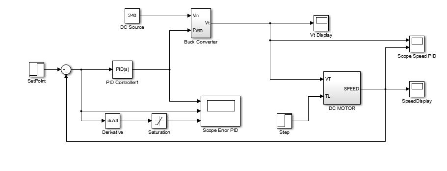
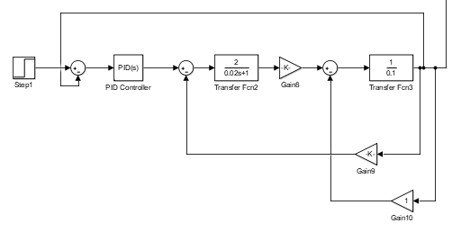
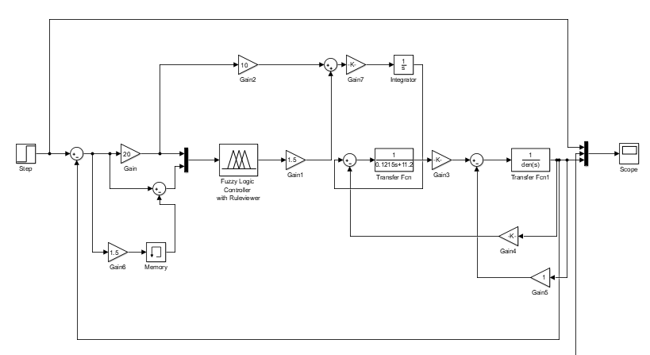
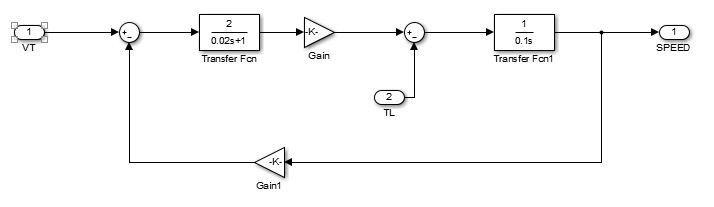
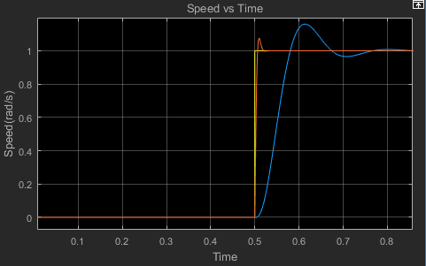

## DC MOTOR TUNING USING FLC AND PID CONTROLLER

**Inputs : Speed Error and Change in Speed Error.**

**System is a non Linear System.**

**Fuzzification Rule : Mamdani Method**

**Defuzzification Rule : Center of Gravity Method**

**PID Controller method : Trial and Error Method**

**Output : Speed**

## ABSTRACT

**Direct current (DC) motors** are controlled easily and have very high performance. The speed of the motors could be adjusted within a wide range. Today, classical control techniques (such as **Proportional Integral Differential - PID**) are very commonly used for speed control purposes. PID controller requires a mathematical model of the system. However, it is observed that the classical control techniques **do not have an adequate performance in the case of nonlinear systems**. Thus, instead, a modern technique is preferred: fuzzy logic. fuzzy logic controller base on experience via rule-based knowledge.** Design of fuzzy logic controller requires many design decisions , for example rule base and fuzzification**. The FLC has two input ,one of these inputs is the speed error and the second is the change in the speed error. There are 49 fuzzy rules which are designed for the fuzzy logic controller. **The center of gravity method is used for the defuzzificztion**. **Fuzzy logic controller uses mamdani system which employs fuzzy sets in consequent part. PID controller chooses its parameters base on trial and error method.** PID and FLC are investigated with the help of MATLAB / SIMULINK package program simulation. It is found that FLC is more difficult to design compared with PID controller, but it satisfies non-linear characteristics of DC motor more suitably. **The results show that the fuzzy logic has minimum transient and steady state parameters , which shows that FLC is more efficient and effective than PID controller**.

## PID SIMULATION CIRCUIT

Figure  : PID Controller

## FUZZY SIMULATION CIRCUIT

Figure  : Fuzzy Logic Controller

## RESULTS : 

Figure : Comparison of PID Controller and Fuzzy Logic Controller

## REFERENCE :
The paper presented shows the significance of the diagrams described. The results obtined are conclusive.

The project was done as a part of course **Power Electronics** in BITS Pilani under the guidence of **Dr. Dheerendra Singh**.

